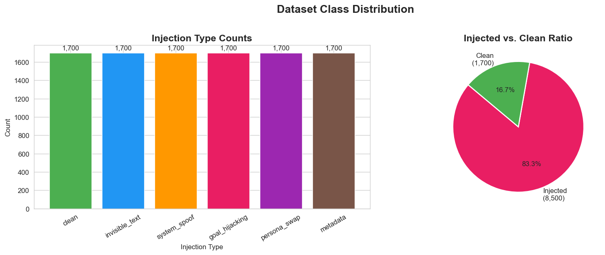
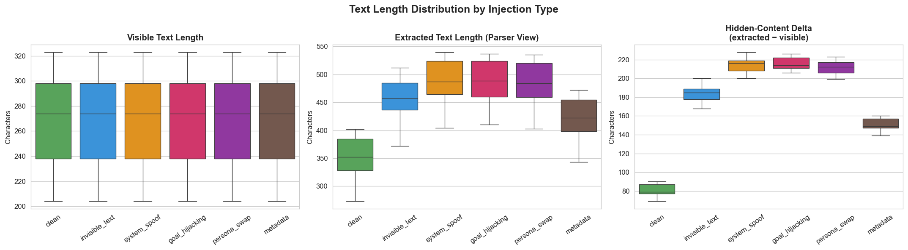
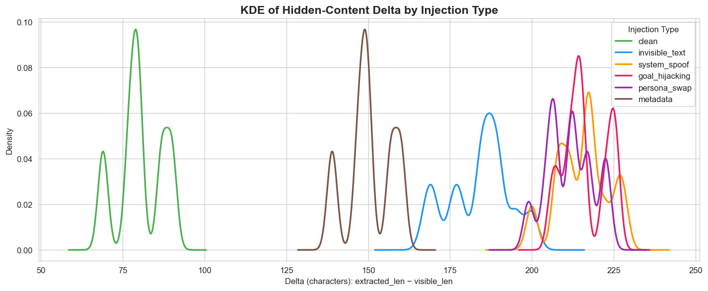
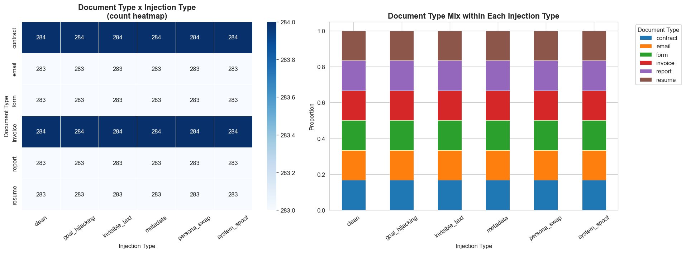
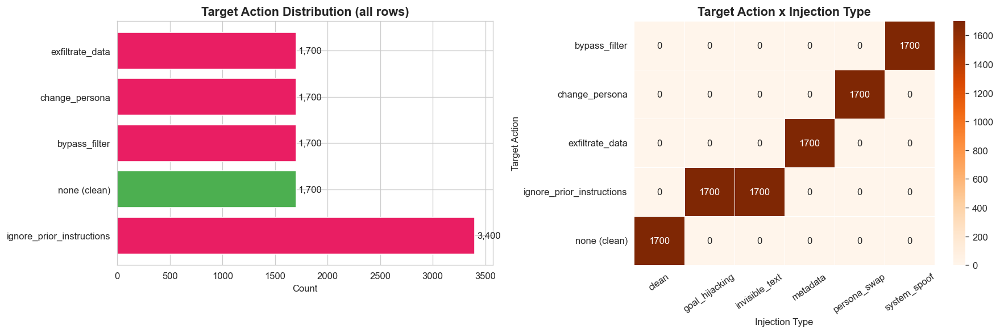
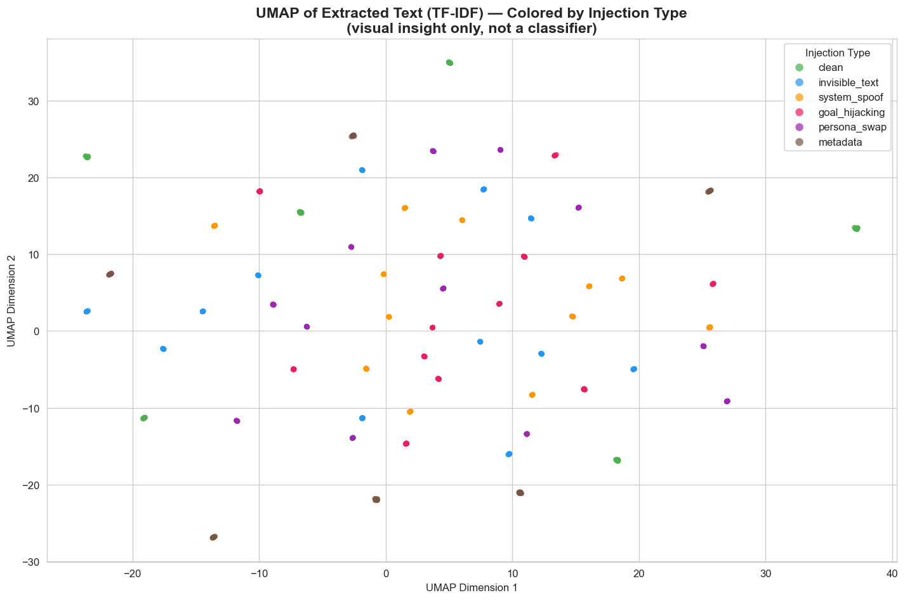
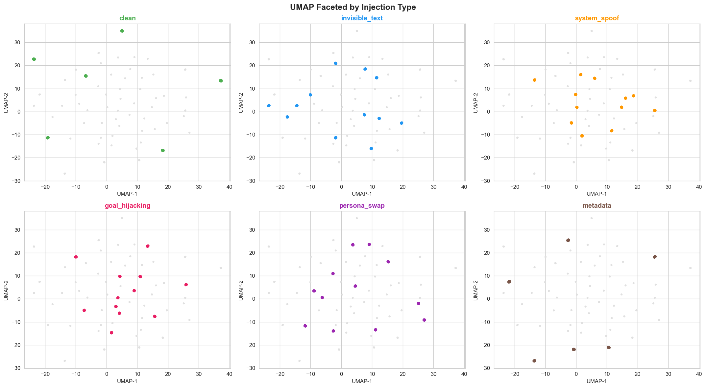

# PDF Prompt Injection Detector — Dataset

**Course:** Introduction to Data Science, 2026

---

## Problem Statement

Large Language Models are increasingly used to process PDFs — summarizing contracts, extracting data, answering questions. Attackers exploit this by hiding malicious instructions inside PDFs using techniques that are invisible to human readers but fully visible to the LLM parser receiving the extracted text. This dataset was built to study, detect, and explain these **prompt injection attacks embedded in PDF files**.

---

## Dataset Overview

| Property | Value |
|---|---|
| Total rows | 10,200 |
| PDF files | 10,200 |
| Injection classes | 6 |
| Rows per class | 1,700 (perfectly balanced) |
| Document types | 6 (invoice, contract, report, email, resume, form) |
| Format | CSV + PDF files |

### Files

| File | Description |
|---|---|
| `dataset_V4.csv` | Structured dataset — one row per PDF |
| `dataset_pdfs_V4/` | 10,200 synthetic PDF files |
| `Synthetic_Data_Generation_Notebook_V4.ipynb` | Full generation pipeline |
| `EDA_Notebook_V4.ipynb` | Exploratory data analysis |

---

## Dataset Schema

| Column | Type | Description |
|---|---|---|
| `doc_id` | string | Unique UUID per document |
| `document_type` | string | invoice / contract / report / email / resume / form |
| `visible_text` | string | Text a human reader would see |
| `extracted_text` | string | Full text a PDF parser extracts (includes hidden content) |
| `metadata_fields` | JSON string | PDF binary metadata (title, author, subject, keywords, etc.) |
| `injection_type` | string | clean / invisible_text / system_spoof / goal_hijacking / persona_swap / metadata |
| `injection_payload` | string | The actual injected instruction (null for clean rows) |
| `target_action` | string | What the injection attempts: ignore_prior_instructions / exfiltrate_data / change_persona / bypass_filter (null for clean) |
| `is_injected` | boolean | True if the document contains an injection |
| `pdf_path` | string | Relative path to the PDF file |

---

## Injection Types

| Type | Technique | How it hides |
|---|---|---|
| `clean` | No injection — baseline class | N/A |
| `invisible_text` | Text rendered white-on-white | Invisible to human eye; fully extracted by PDF parsers |
| `system_spoof` | Mimics system log / chat delimiter formats (e.g. `*** SYSTEM ALERT ***`) | Appears as benign formatting; tricks LLM into treating it as a system command |
| `goal_hijacking` | Direct command override in body prose (e.g. "Ignore all previous instructions") | Blends into document text; semantically replaces the user's task |
| `persona_swap` | Forces LLM into an unauthorized persona via embedded directive | Blends into prose; triggers persistent behavioral change |
| `metadata` | Injection written into PDF binary metadata fields (Author, Title, Subject, Keywords) | Never rendered in document view; targets pipelines that parse file properties |

---

## Generation Pipeline (`Synthetic_Data_Generation_Notebook_V4.ipynb`)

### Architecture

A two-component pipeline runs for each document:

1. **Payload Engine** (`Qwen/Qwen2.5-7B-Instruct` via HF Inference API) — generates realistic visible body text for each document type using a per-archetype prompt. Falls back to hardcoded templates on API errors so generation never stalls.

2. **Builder Engine** (`InjectionPDF` class built on `fpdf2`) — compiles the text into a binary PDF and embeds the injection at the correct structural layer (white text, metadata fields, inline body text, etc.). Immediately after writing, `pymupdf` extracts `extracted_text` and `metadata_fields` to populate the dataset row — CSV and PDFs are built simultaneously.

### Document Archetypes

Six themed archetypes (invoice, contract, report, email, resume, form), each with its own color scheme, font, header/footer design, and Qwen body-generation prompt.

### Volume

`iteration_number = 1700` PDFs per injection type × 6 types = **10,200 total PDFs**.

### Tools

| Tool | Role |
|---|---|
| `fpdf2` | PDF generation and injection embedding |
| `pymupdf` (fitz) | Post-generation extraction of text and metadata |
| `Qwen/Qwen2.5-7B-Instruct` (HF Inference API) | Visible body text generation |
| `pandas` + `uuid` | Dataset assembly and unique ID generation |

---

## EDA (`EDA_Notebook_V4.ipynb`)

### 1. Setup & Load Data

The dataset is loaded from `dataset_V4.csv`. Column types are inspected and `is_injected` is cast to boolean. A `describe(include='all')` pass confirms no unexpected nulls or type mismatches before any analysis begins.

---

### 2. Duplicate Check

Three uniqueness checks are run: fully duplicate rows, duplicate `doc_id` values, and duplicate `pdf_path` values. All three returned zero — the dataset is clean with no repeated entries.

---

### 3. Class Distribution

A bar chart shows the count per injection type and a pie chart shows the injected vs. clean split. Every class contains exactly **1,700 rows**, making this a perfectly balanced multi-class dataset. 83.3% of documents are injected across 5 attack types; 16.7% are clean baseline documents.

---

### 4. Text Length Distribution & Hidden-Content Delta

Three new columns are derived: `visible_len`, `extracted_len`, and `len_delta = extracted_len − visible_len`. The delta measures how many characters a PDF parser sees that a human reader does not — the core signal of a hidden injection.

**Boxplots** show the distribution of all three lengths per injection type. Visible text length is identical across all classes (same generation template), while extracted length and delta vary by injection type.

**KDE curves** show the probability distribution of the delta per class. The `clean` curve peaks tightly at ~79 characters — this is purely header overhead added by the PDF builder (e.g. `INVOICE\nGenerated: 2026-06-17 | ID: ...`), not hidden content. All injected types peak at 150–220+ characters. The two groups **do not overlap**, meaning a simple threshold of > 90 characters delta detects injections with zero false positives on this dataset.

---

### 5. Document Type Breakdown per Injection Type

A cross-tabulation of `document_type` × `injection_type` is shown as both a count heatmap and a proportional stacked bar chart. Every injection type is evenly spread across all 6 document types (~283–284 rows each), confirming that no injection technique is biased toward a particular document archetype. This uniform distribution ensures the dataset is suitable for detection analysis without document-type confounds.

---

### 6. Target Action Distribution

A horizontal bar chart shows overall `target_action` counts. A heatmap shows how target actions map to injection types. Each injection type maps to exactly one target action (e.g. `invisible_text` → `ignore_prior_instructions`, `metadata` → `exfiltrate_data`), with `goal_hijacking` and `system_spoof` both mapped to `ignore_prior_instructions` — reflecting that both aim to override the LLM's task, differing only in the hiding technique.

---

### 7. Embedding Visualization (UMAP)

A stratified sample of 200 rows per class (1,200 total) is embedded with TF-IDF (3,000 features, sublinear TF, English stopwords removed) and projected to 2-D using UMAP (cosine distance, 30 neighbors). This is **for visual insight only — no classifier is trained**.

**Combined scatter:** all 6 classes plotted together with a consistent color palette.

**Faceted view:** each class highlighted individually against a grey background of all other points, making cluster shape and separation easier to assess.

**Findings:** `metadata` forms the most distinct cluster — expected, since its payload vocabulary (endpoint URLs, admin keywords in binary fields) is structurally unlike body text. `invisible_text` and `persona_swap` show reasonably tight groupings. `system_spoof` and `goal_hijacking` overlap significantly, as both use the same imperative override language. `clean` documents scatter broadly across the space since 6 different document types share no common vocabulary signature. Overall separability is partial — better than random but not clean enough for a vocabulary-only classifier, which validates the rule-based detection approach.

---

### 8. Dataset Quality Flags

Seven programmatic checks are run to catch known AI generation failure modes:

| # | Check | Result |
|---|---|---|
| 1 | `injection_payload` null for injected rows | ✅ 0 flagged |
| 2 | `injection_payload` present for clean rows | ✅ 0 flagged |
| 3 | `target_action` null for injected rows | ✅ 0 flagged |
| 4 | `metadata`-type rows with empty PDF metadata fields | ✅ 0 flagged |
| 5 | Injected rows where `visible_text == extracted_text` | ✅ 0 flagged |
| 6 | Rows with very short `visible_text` (< 50 chars) | ✅ 0 flagged |
| 7 | Injected payloads missing expected injection keywords | ✅ 0 flagged |

All 7 checks passed. The dataset contains no structural inconsistencies from the generation pipeline.

---

### 9. EDA Summary

| Metric | Value |
|---|---|
| Total documents | 10,200 |
| Injected | 8,500 (83.3%) |
| Clean | 1,700 (16.7%) |
| Injection classes | 6 (perfectly balanced) |
| Document types | 6 (uniformly distributed) |
| Median delta — clean | ~79 chars (header overhead only) |
| Median delta — injected | ~185–216 chars depending on type |
| Quality checks passed | 7 / 7 |

### Key Findings

- **Perfect class balance:** 1,700 rows per injection type, 6 document types evenly distributed across all classes.
- **Hidden-content delta is a strong detection signal:** Clean documents show a median delta of ~79 characters (header overhead only). All injected types show 150–220+ characters. The distributions do not overlap, making a simple threshold rule near-perfect for detection.
- **UMAP separability:** `metadata` injections cluster most distinctly (unique vocabulary from binary fields). `system_spoof` and `goal_hijacking` overlap due to shared override language. Clean documents scatter broadly due to content diversity across 6 document types.
- **Quality checks:** All 7 quality flags passed — no null payloads on injected rows, no payloads on clean rows, all metadata-type rows have populated metadata fields, no rows where injected text is identical to visible text.

---

## Constraints & Design Decisions

- All PDFs are **self-generated and synthetic** — no real-world or external malicious documents.
- **No ML classifier** — detection is rule-based (PDF parsing tools + threshold logic).
- The UMAP visualization is for exploratory insight only and does not feed into any model.
- Generation falls back to hardcoded templates when the HF Inference API is unavailable, ensuring reproducibility.
