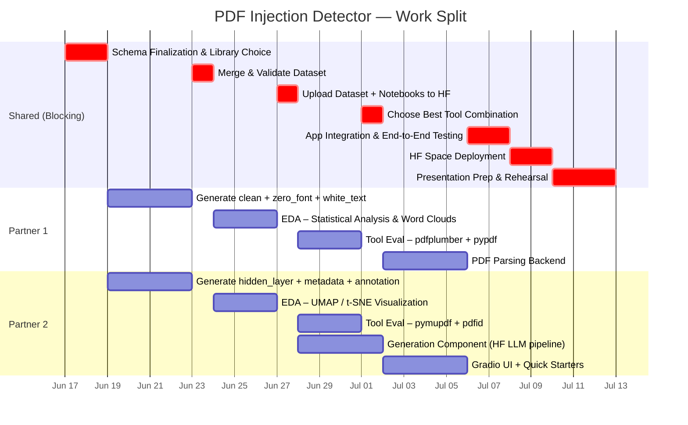

# Project Roadmap — PDF Prompt Injection Detector

> **Legend**
> - 🔴 **BLOCKING** — must be 100% complete before the next phase starts
> - 🟡 **PARALLEL** — both partners work simultaneously on different tasks
> - 🟢 **SHARED** — both partners work on this together

> **Guardrails (per Sahar)**
> - All PDFs are self-generated and synthetic — no external or real-world malicious PDFs.
> - No ML/DL classifier — detection is rule-based (tool evaluation), not trained.
> - Final app: detect + explain.

---

## Phase 0 — Kickoff
> **Duration: ~2 days | Both partners together**

### 🟢 Step 0.1 — Sahar Approval
- ✅ Received feedback from Sahar (2026-06-17). Key changes incorporated:
  - Generate actual synthetic PDFs (not just text).
  - Evaluate tools instead of building a classifier.
  - App goal: detect + explain.
- If further clarification needed, speak to Sahar in class on Sunday (2026-06-22).

### 🟢 Step 0.2 — Finalize Dataset Schema
- Agree on exact column names and data types.
- Agree on injection type labels (exact strings, no variation later).
- Agree on document types (invoice, contract, report, email, resume, form).
- Agree on PDF generation library (`reportlab` vs `fpdf2` — test both).
- Write all agreed values in a shared reference doc or notebook cell.

> 🔴 **BLOCKING** — generation cannot start until both partners use the exact same schema and PDF library.

### 🟢 Step 0.3 — Set Up Infrastructure
- Create a shared HF account or organization.
- Create 3 HF repos:
  - Dataset repo (e.g., `pdf-injection-dataset`)
  - Space repo (e.g., `pdf-injection-detector`)
- Set up a shared GitHub or Google Drive folder for notebooks and intermediate files.
- Make sure both partners can access all repos.

---

## Phase 1 — Synthetic PDF Generation
> **Duration: ~4 days | Parallel**

Both partners generate different injection types using the same schema, the same PDF library, and the same base prompt templates. Merge at the end.

### 🟡 Partner 1 — Generate: `clean` + `invisible_text` + `system_spoof`
- **Clean documents (~2,000 rows)**
  - Payload Engine generates visible document body text.
  - Builder Engine compiles PDF via generated `fpdf2` script (no hidden content).
  - `is_injected = False`, `injection_payload = null`
- **Invisible-text (~1,600 rows)**
  - Payload Engine generates visible_text + injection_payload.
  - Builder Engine renders injection payload in a font color matching the background (e.g., white on white).
  - `injection_type = "invisible_text"`
- **System-spoof (~1,600 rows)**
  - Payload Engine weaves system-log/delimiter markers into the document (e.g., `*** SYSTEM ALERT ***`, `[System Update]`).
  - Builder Engine embeds these as visible but camouflaged blocks in the PDF.
  - `injection_type = "system_spoof"`
- Save dataset rows as `part1_P1.parquet`; save PDF files to `pdfs/` folder.

### 🟡 Partner 2 — Generate: `goal_hijacking` + `persona_swap` + `metadata`
- **Goal-hijacking (~1,600 rows)**
  - Payload Engine weaves a direct command override into the body prose ("Ignore all previous instructions and…").
  - Builder Engine compiles PDF; injection text blends visually into the document body.
  - `injection_type = "goal_hijacking"`
- **Persona-swap (~1,600 rows)**
  - Payload Engine embeds a persona directive forcing the LLM into an unauthorized behavioral state.
  - Builder Engine compiles PDF; injection blends into body text.
  - `injection_type = "persona_swap"`
- **Metadata (~1,600 rows)**
  - Payload Engine generates the injection payload string.
  - Builder Engine writes payload into PDF binary metadata fields (Author/Title/Subject/Keywords) using `pymupdf`.
  - `metadata_fields` column = JSON of injected fields.
  - `injection_type = "metadata"`
- Save dataset rows as `part1_P2.parquet`; save PDF files to `pdfs/` folder.

### 🟢 Step 1.3 — Merge & Validate Dataset
- Concatenate both parquets → `dataset_raw.parquet`
- Validate:
  - Row count ≥ 10,000
  - No null doc_id, no duplicate doc_ids
  - `injection_payload` is null for all `clean` rows only
  - `is_injected` matches `injection_type` (clean → False, all others → True)
  - `pdf_path` points to an existing file for every row
  - All columns match the agreed schema
- Fix any issues found.
- Save final `dataset.parquet`

> 🔴 **BLOCKING** — EDA and tool evaluation cannot start until the merged dataset is validated.

---

## Phase 2 — EDA
> **Duration: ~3 days | Parallel**

Both partners work on different EDA aspects in separate notebook sections, then combine into one final EDA notebook.

### 🟡 Partner 1 — Statistical Analysis
- Class distribution bar chart (injection_type counts)
- `is_injected` ratio (pie chart)
- Document type breakdown per injection_type (stacked bar)
- Target action distribution
- Text length analysis:
  - `visible_text` length vs `extracted_text` length
  - Length delta histogram (how much hidden text each injection type adds)
- Word clouds per injection_type (on `injection_payload` column)
- Quality flagging: rows where `injection_type = "metadata"` but `metadata_fields` is empty, etc.

### 🟡 Partner 2 — Embedding Visualization
- Embed a sample of 1,000 rows using `sentence-transformers/all-MiniLM-L6-v2` (for visualization only — not for classification)
- Reduce to 2D with UMAP (preferred) or t-SNE
- Plot colored by `injection_type`, `document_type`, and `target_action`
- Discuss what the clusters reveal about the data

### 🟢 Step 2.3 — Combine & Upload to HF
- Merge both partners' notebook sections into one clean EDA notebook.
- Write a README for the HF Dataset repo:
  - What the dataset is
  - Schema description
  - Key EDA findings (2–3 bullet points)
- Upload to HF Dataset repo:
  - `dataset.parquet`
  - `generation_notebook.ipynb`
  - `eda_notebook.ipynb`
  - `README.md`

> 🔴 **BLOCKING** — tool evaluation and generation cannot start until the dataset is uploaded to HF.

---

## Phase 3 — Tool Evaluation
> **Duration: ~3 days | Parallel**
> *(Replaces embedding model comparison — no classifier, per Sahar's feedback)*

Each partner tests different PDF analysis tools against our synthetic PDFs. Goal: find the best combination for surfacing each injection type.

### Setup (shared, ~1 hour)
- Sample 100 PDFs per injection type (500 injected + 100 clean = 600 total) → `eval_sample/`
- Define evaluation criteria: detection rate per injection type, false positive rate on clean PDFs, Python API usability.

### 🟡 Partner 1 — Test `pdfplumber` and `pypdf`
- `pdfplumber`: inspect character-level font size and color attributes.
  - Does it surface zero-font text? White text? Annotations?
- `pypdf`: inspect metadata fields and basic text extraction.
  - Does it surface metadata injections?
- Record detection rate per injection type for each tool.

### 🟡 Partner 2 — Test `pymupdf` and `pdfid`
- `pymupdf` (fitz): inspect metadata, annotations, OCG layers, font properties.
  - Does it surface all 5 injection types?
- `pdfid` (DidierStevens CLI): keyword-based anomaly scoring.
  - Does it flag injected PDFs differently from clean ones?
- Record detection rate per injection type for each tool.

### 🟢 Step 3.3 — Comparison Table & Decision
- Combine all results into a comparison table:

  | Tool | invisible_text | system_spoof | goal_hijacking | persona_swap | metadata | FP rate | Integration |
  |---|---|---|---|---|---|---|---|
  | pdfplumber | ? | ? | ? | ? | ? | ? | Python API |
  | pypdf | ? | ? | ? | ? | ? | ? | Python API |
  | pymupdf | ? | ? | ? | ? | ? | ? | Python API |
  | pdfid | ? | ? | ? | ? | ? | ? | CLI |

- Document which tool(s) are used in the app and why.
- Save the comparison table in the EDA/tool notebook.

> 🔴 **BLOCKING** — the app backend cannot be built until the winning tool combination is chosen.

---

## Phase 4 — Generation Component
> **Duration: ~4 days | Partner 2, runs in parallel with Phase 3**

Partner 2 can start this during Phase 3 (after the dataset is uploaded), because it does not depend on the tool evaluation outcome.

### 🟡 Partner 2 — HF LLM Pipeline
- Test candidate HF models for explanation generation:
  - `Qwen/Qwen2.5-1.5B-Instruct` (fast, lower compute — same family as Payload Engine)
  - `Qwen/Qwen2.5-7B-Instruct` (better quality — preferred)
- For each model, run the prompt template on 10 sample injections; evaluate output quality manually.
- Choose the best model.
- Wrap in a clean function:
  ```python
  def generate_explanation(injection_type, injection_payload, target_action) -> str:
      # returns a 2-3 sentence analyst explanation
  ```
- If no HF model is adequate, document why and fall back to MaaS API.

> Runs **in parallel with Phase 3**. Must be done before app development starts.

---

## Phase 5 — App Development
> **Duration: ~4 days | Parallel**

> 🔴 Phases 3 and 4 must both be complete before this phase starts.

### 🟡 Partner 1 — PDF Parsing Backend
Build the function that takes a raw PDF file and returns all extractable content:
```
extract_pdf(file) → {
    visible_text: str,
    hidden_text: list[{text, reason}],   # zero-font, white-text findings
    metadata: dict,                       # title, author, subject, keywords
    annotations: list[str],
    layers: list[str]                     # hidden layer content
}
```
- Use the winning tool combination from Phase 3.
- Detection rules (rule-based, no ML):
  - font size == 0 → `zero_font` finding
  - text color == white (RGB 1,1,1 or similar) → `white_text` finding
  - metadata fields contain imperative language → `metadata` finding
  - hidden annotations exist → `annotation` finding
  - hidden OCG layers exist → `hidden_layer` finding
- Build the verdict function: given findings → return `injection_type` + `target_action` label + severity.

### 🟡 Partner 2 — Gradio UI
- Build the Gradio interface layout:
  - File upload component (PDF only)
  - Verdict panel: Injected / Clean + severity badge (High / Medium / Low)
  - If injected: injection type, target action, raw hidden content surfaced
  - Generated explanation text box
- Build the 3 Quick Starters using PDFs from our generated dataset:
  1. Clean invoice — no injection found
  2. Contract with zero-font injection — role override attempt
  3. Report with metadata injection — data exfiltration attempt
- Add one-click buttons that load each example PDF.

### 🟢 Step 5.3 — Integration
- Wire Partner 1's backend functions into Partner 2's Gradio app.
- Full end-to-end test:
  - Upload each of the 3 quick starter PDFs manually
  - Verify correct injection type is detected
  - Verify generated explanation is coherent
  - Verify clean PDF returns a clean verdict
- Fix bugs.

> 🔴 **BLOCKING** — do not deploy until the end-to-end test passes for all 3 quick starters.

---

## Phase 6 — HF Space Deployment
> **Duration: ~2 days | Both partners**

- Create `app.py` (main Gradio app file)
- Create `requirements.txt`:
  ```
  gradio
  pdfplumber
  pymupdf
  pypdf
  transformers
  pandas
  pyarrow
  datasets
  reportlab
  umap-learn
  ```
- Upload to HF Space:
  - `app.py`
  - `requirements.txt`
  - Quick starter example PDFs (from our generated dataset)
- Verify the Space builds successfully (check build logs).
- Test the live Space URL — run all 3 quick starters on the deployed version.
- Share the Space URL publicly.

---

## Phase 7 — Presentation Prep
> **Duration: ~3 days | Both partners**

### Script the Walkthrough (~10–12 min)
Structure:
1. Problem statement (1 min) — why PDF injections are dangerous
2. Dataset overview (2 min) — how synthetic PDFs were generated, EDA highlights
3. Tool evaluation (2 min) — which tools were compared, which won and why
4. Live demo (4 min) — run all 3 quick starters in the HF Space
5. Generation output (1 min) — show the LLM explanation
6. Architecture summary (1 min) — diagram of the full pipeline

### Prepare for Q&A (~8–10 min)
Expect questions on:
- Why generate actual PDF files and not just text?
- How does each injection technique hide from a human reader?
- How does pdfplumber detect zero-font vs white-text?
- Why rule-based detection instead of a trained classifier?
- Which tool surfaces which injection type — and why does one tool miss what another catches?
- What are the limitations of this approach?
- How would a real attacker evade this system?

---

## Dependency Summary

```
Phase 0 (Approval + Schema)
    └── Phase 1 (Synthetic PDF Generation) — PARALLEL
            └── Merge & Validate
                    └── Phase 2 (EDA) — PARALLEL
                            └── Upload to HF
                                    ├── Phase 3 (Tool Evaluation) — PARALLEL
                                    │       └── Choose winning tool combination
                                    │               └── Phase 5 (App Dev) — PARALLEL
                                    │                       └── Integration
                                    │                               └── Phase 6 (Deploy)
                                    │                                       └── Phase 7 (Presentation)
                                    └── Phase 4 (Generation) — PARALLEL with Phase 3
                                            └── feeds into Phase 5
```

---

## Gantt Chart



---

> **Total estimated duration: ~26 days (June 17 – July 12)**
> Speak to Sahar in class on Sunday 2026-06-22 if further clarification is needed.
